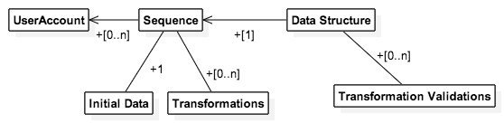

# The Datastructor Server

***

## Contents

1. [Introduction](#1-introduction)
  1. [Purpose](#11-purpose)
  2. [Project Scope](#12-project-scope)
  3. [References](#13-references)
2. [Overall Description](#2-overall-description)
  1. [Product Perspective](#21-product-perspective)
  2. [User Classes and Characteristics](#22-user-classes-and-characteristics)
  3. [Operating Environment](#23-operating-environment)
3. [Use Cases](#3-use-cases)
  1. [Account Management](#31-account-management)
    1. [Registration](#311-registration)
    2. [Log In](#312-log-in)
    3. [Log Out](#313-log-out)
  2. [Generating Data](#32-generating-data)
    1. [Generating Gaussian Distributions](#321-generating-gaussian-distributions)
    2. [Generating Uniform Distributions](#322-generating-uniform-distributions)
  3. [Sequences](#33-sequences)
    1. [Create](#331-create)
    2. [Retrieve](#332-retrieve)
    3. [Update](#333-update)
    4. [Delete](#334-delete)
4. [Data Requirements](#4-data-requirements)
  1. [Logical Data Model](#41-logical-data-model)
  2. [Data Dictionary](#42-data-dictionary)
5. [External Interface Requirements](#5-external-interface-requirements)
  1. [API](#51-api)

***

## 1. Introduction

***

### 1.1 Purpose

This project will serve as a teaching tool for data structures and algorithms.  It will allow instructors to create instances of data structures, populate those data structures with data, perform operations on those data structures, and record the sequence of manipulations to those data structures for future modification and playback.

The purpose of the server component is overall persistence for the application. 

[back to top](#contents)

*** 

### 1.2 Project Scope

The overall project will consist of the following: a server application which will provide the core functionality, accessible through a programmable interface; a suite of end-to-end tests for the server; and a web client providing a UI.  __The scope of this SRS is limited to the server application.__  The client application (which is within the scope of this project) will be described in an alternate SRS.

[back to top](#contents)

***

### 1.3 References

- Client Application
  - [SRS](../client/SRS.md)

[back to top](#contents)

***

## 2. Overall Description

***

### 2.1 Product Perspective

The application has no relation to any existing applications.  It is an entirely new product.

The product will be consumed by a client application, which is part of the same project. 

[back to top](#contents)

*** 

### 2.2 User Classes and Characteristics

Currently, the application only has a single class of users.

[back to top](#contents)

***

### 2.3 Operating Environment

The server application will run in a portable [Docker](https://www.docker.com/) container to avoid environment constraints.  The only constraint will be that Docker is installed.

The client web application will support the following browsers: Internet Explorer 10+, Safari, Chrome, Firefox and Opera 10+.

[back to top](#contents)

*** 

## 3. Use Cases

***

### 3.1 Account Management

***

#### 3.1.1 Registration

As a user, I should be able to register for the application using a single sign on identity like a Facebook or Google account.

__Preconditions:__

- I am not logged into an account

__Postconditions:__

- An account is created for me
- My identity is associated with that account

__Failure Scenarios:__

- The email address associated with the identity I have chosen is already part of an account.

__Alternate Scenarios:__

- The identity I have chosen is already registered; see [Log In](#312-log-in) scenario.

[back to top](#contents)

***

#### 3.1.2 Log In

As a user, I should be able to log in to my account using my single sign on identity.

__Preconditions:__

- I am not logged into an account

__Postconditions:__

- I am logged into an account

__Failure Scenarios:__

- There is no account matching the email address retrieved from the SSO.
- The SSO used is not associated with the matching account

[back to top](#contents)

***

#### 3.1.3 Log Out

As a user, I should be able to log out of my account 

__Preconditions:__

- I am logged into an account

__Postconditions:__

- I am not logged into an account

[back to top](#contents)

***

### 3.2 Generating Data

***

#### 3.2.1 Generating Gaussian Distributions

As a user, I should be able to generate a random data with a Gaussian distribution.

__Preconditions:__

- I am logged into an account

[back to top](#contents)

***

#### 3.2.2 Generating Uniform Distributions

As a user, I should be able to generate a random data set with a uniform distribution.

__Preconditions:__

- I am logged into an account

[back to top](#contents)

***

### 3.3 Sequences

***

#### 3.3.1 Create

As a user, I should be able to create a sequence

__Preconditions:__

- I am logged into an account

__Postconditions:__

- I own the newly created sequence

__Failure Scenarios:__

- The sequence data provided is malformed (e.g. an invalid operation for the data structure)

[back to top](#contents)

***

#### 3.3.2 Retrieve

As a user, I should be able to retrieve a sequence

__Preconditions:__

- I am logged into an account
- I own the sequence

[back to top](#contents)

***

#### 3.3.3 Update

As a user, I should be able to update a sequence

__Preconditions:__

- I am logged into an account
- I own the sequence

__Failure Scenarios:__

- The sequence data provided for the update is (e.g. an invalid operation for the data structure)

[back to top](#contents)

***

#### 3.3.4 Delete

As a user, I should be able to delete a sequence

__Preconditions:__

- I am logged into an account
- I own the sequence

__Postconditions:__

- I no longer own the sequence :'(

[back to top](#contents)

***

## 4. Data Requirements

***

### 4.1 Logical Data Model

[back to top](#contents)

***

### 4.2 Data Dictionary

- __Data Structure__: A data structure defines validations for sequences
  - __Initial Data Validation__: Defines what initial data can be used for the data structure
  - __Transformation Validations__: Defines what operations can be performed on the data structure
- __Sequence__: A series of manipulations performed on a data set
  - __Initial Data__: The initial values for the data set
  - __Transformations__: A set of transformations to performed on the initial data set
  - __Frame__: Within the scope of the project, `frame x` is the state of the data structure after applying `x` transformations to the initial data
- __User__: A user of the application, who can own multiple sequences

[back to top](#contents)

***

### 4.3 Risks

Visualization frames are defined by a series of transformations on an initial data set.  A frame is recursively generated from the previous frames.  As a result, the initial loading time of a frame deep in a sequence may be high.  However, having frames generated incrementally will make for easy changes.  For example, a making a change to a piece of data that exists for 50 frames will require one modification instead of 50.  If load times become a problem, a potential solution is generating 'skip-frames' of the same format as the initial data.

***

## 5. External Interface Requirements

***

### 5.1 API

Each of the [use cases](#4-use-cases) described will be accessible via a RESTful HTTP API.

[back to top](#contents)

